# 绘语AI

    

    
    
    
    
    

## 绘语AI 是什么？

绘语AI是一套面向普通用户，提供 Stable Diffusion AI绘画功能的程序，现已支持微信小程序端，并有完善的Web后台管理界面。

模块结构分为：

- **Web后台管理 - 本仓库**
- [后端服务](https://github.com/HuiyuAI/huiyu-cloud)
- [uniapp用户端（已支持微信小程序）](https://github.com/HuiyuAI/huiyu-uniapp)
- [SD调用端（对接 Stable Diffusion API 的程序）](https://github.com/HuiyuAI/huiyu-sdapi)

## 功能预览

微信小程序端：

|            首页             |            画夹             |            广场             |            我的             |
| :-------------------------: | :-------------------------: | :-------------------------: | :-------------------------: |
| 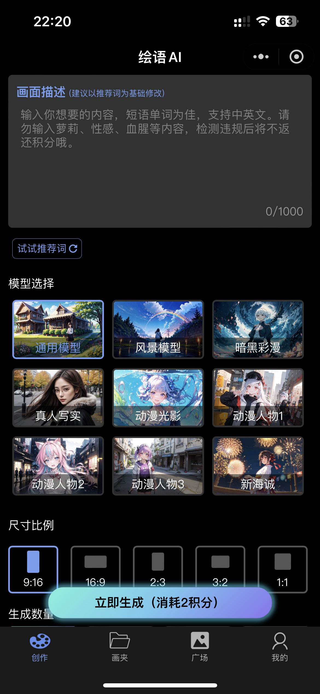 |  | 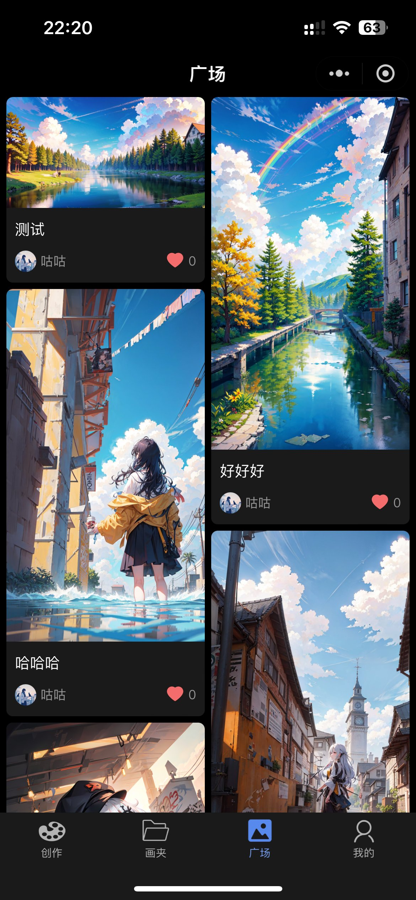 | 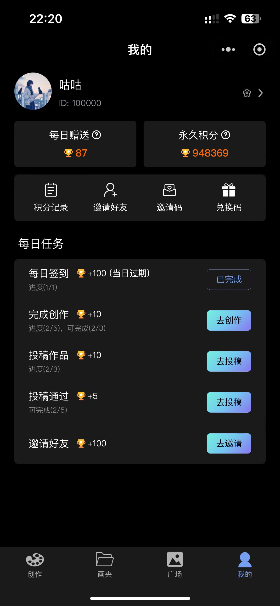 |
|      **画夹作品详情**       |      **广场作品详情**       |        **积分记录**         |        **个人信息**         |
| 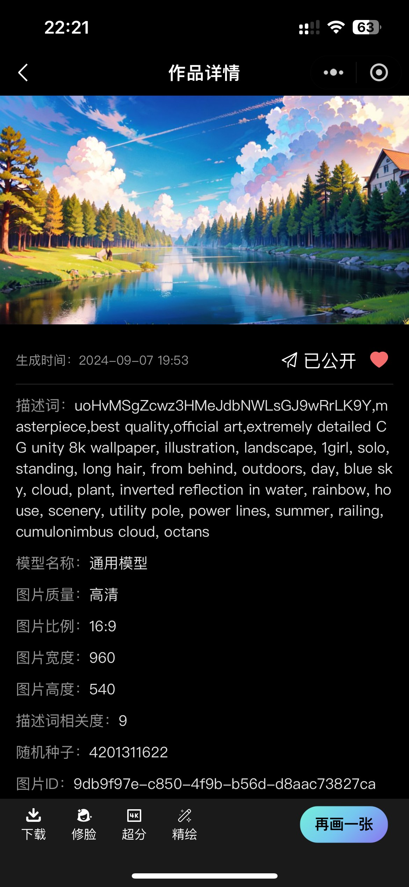 | 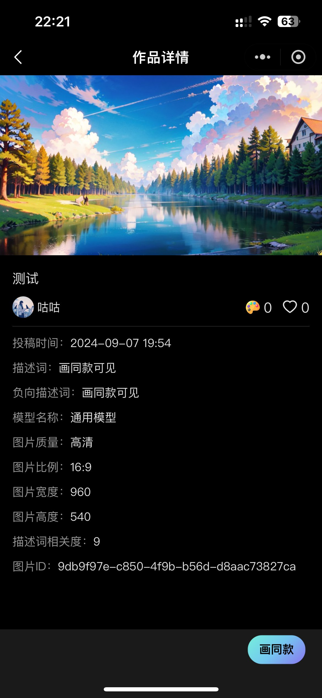 | 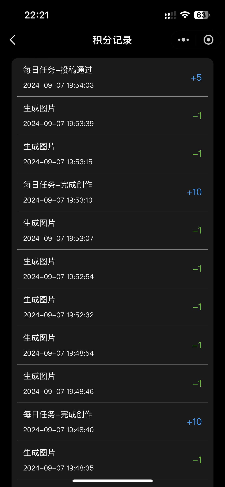 |  |

Web管理端：

| 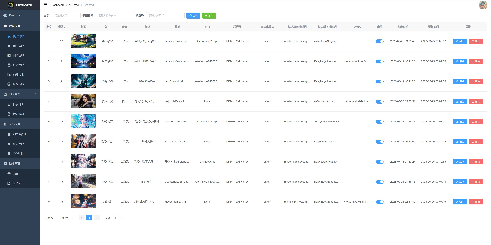  | 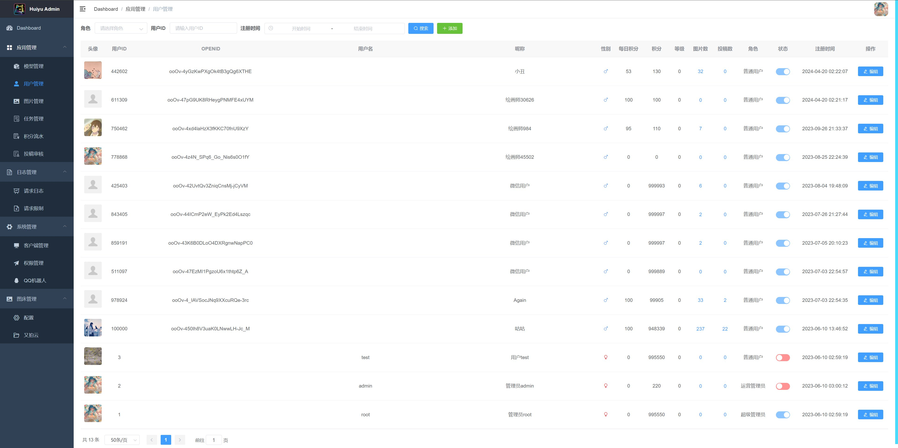  |
| ---------------------- | ---------------------- |
| 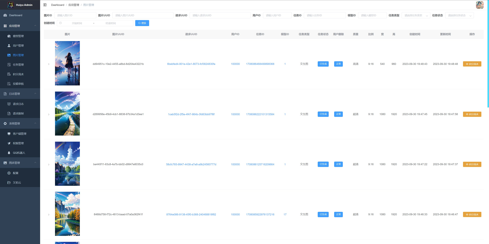  | 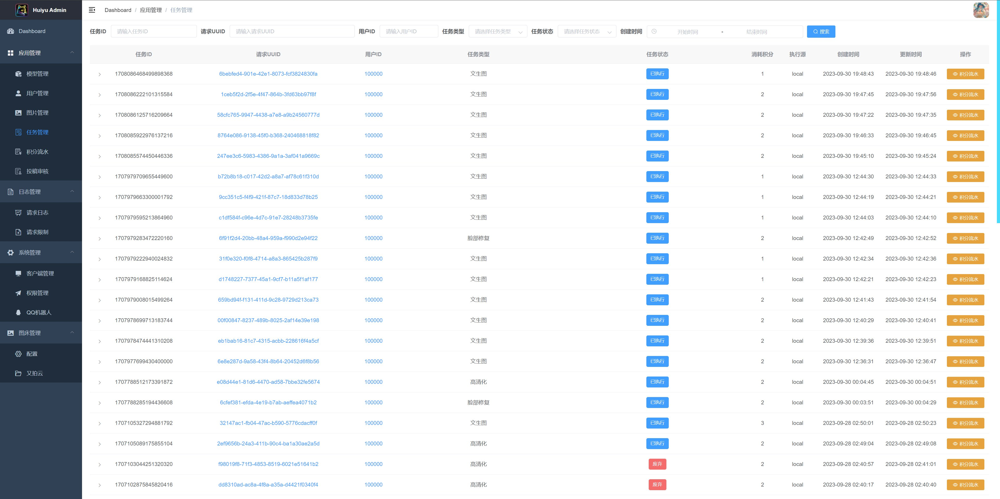  |
| 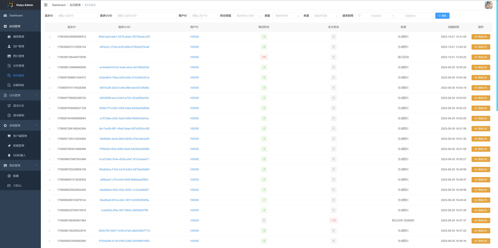  | 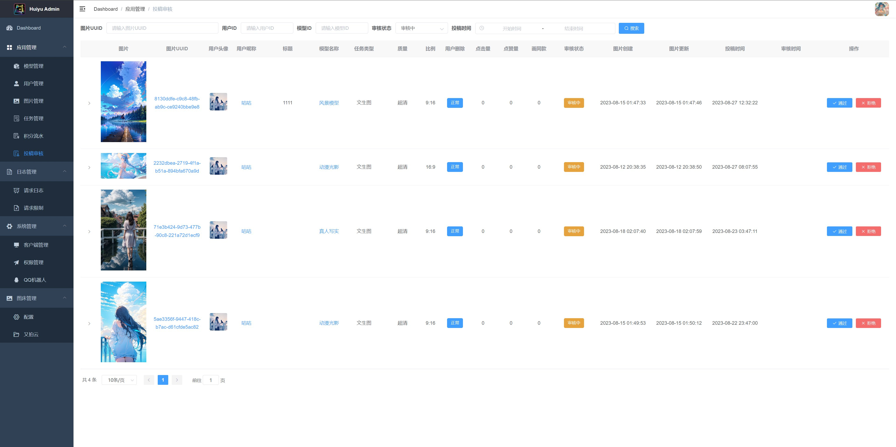  |
| 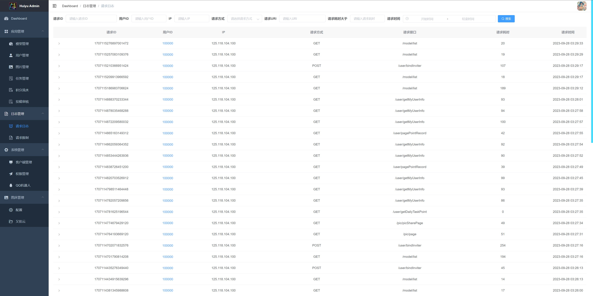  | 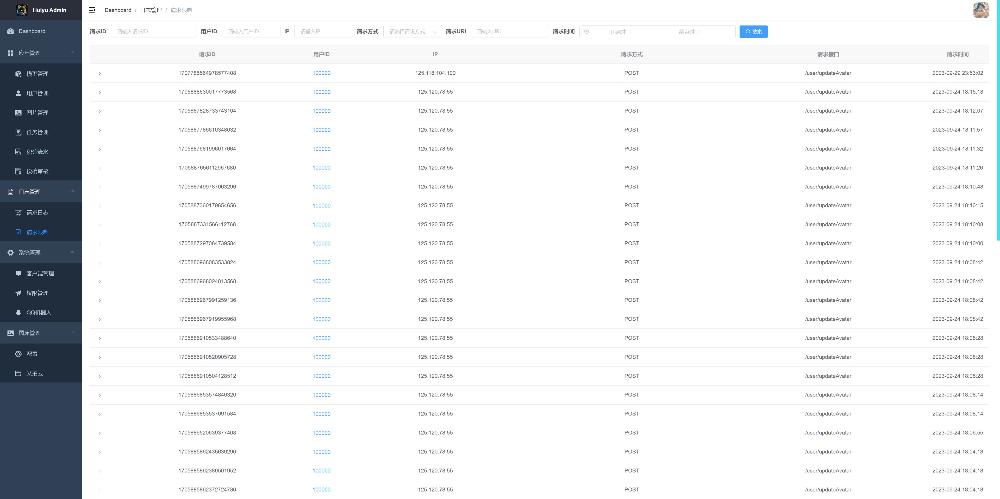  |
| 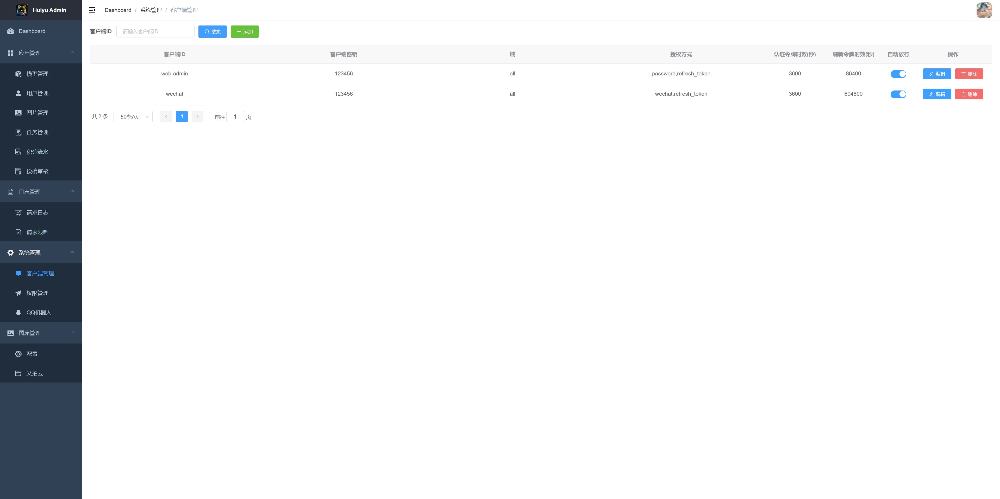  | 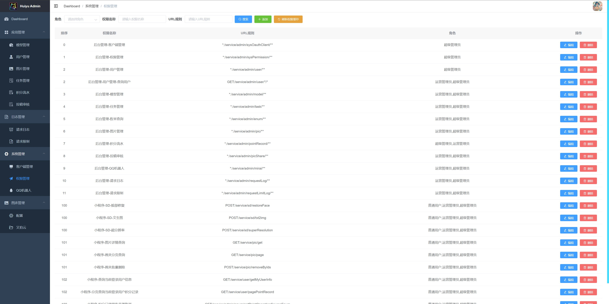 |
| 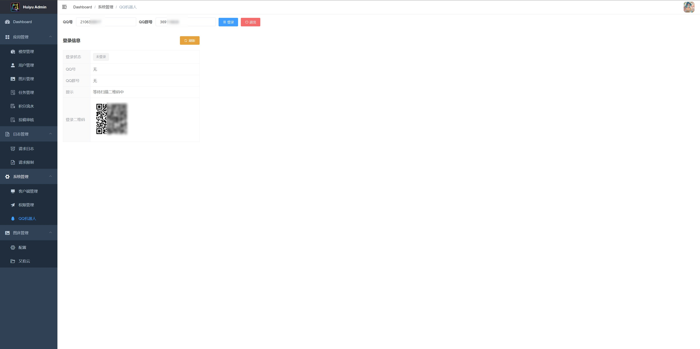 |  |

QQ机器人功能预览：

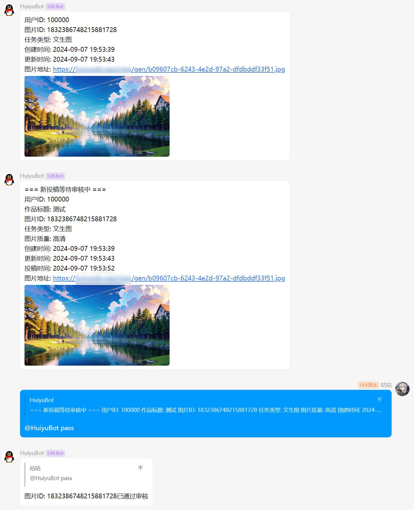

## 功能特性

参见[后端服务](https://github.com/HuiyuAI/huiyu-cloud)

## 快速开始

> [!NOTE]
>
> 如需完整运行所有模块，强烈建议有 Stable Diffusion 相关的安装、使用经验者尝试
>
> 以下仅包括**Web后台管理 - 本仓库**的运行方式，其它模块请看：
>
> - [后端服务](https://github.com/HuiyuAI/huiyu-cloud)
> - [uniapp用户端](https://github.com/HuiyuAI/huiyu-uniapp)
> - [SD调用端](https://github.com/HuiyuAI/huiyu-sdapi)

1. 将 `/src/settings.js` 中的 `baseServerUrl` 与后端服务的网关 `Gateway8000` 地址保持一致
2. 安装依赖 `npm install`
3. 本地运行 `npm run serve`

>  如需构建静态资源 `npm run build`

## 常见问题

参见[后端服务](https://github.com/HuiyuAI/huiyu-cloud)

## LICENSE

[MIT](https://github.com/HuiyuAI/huiyu-web-admin/blob/master/LICENSE)

